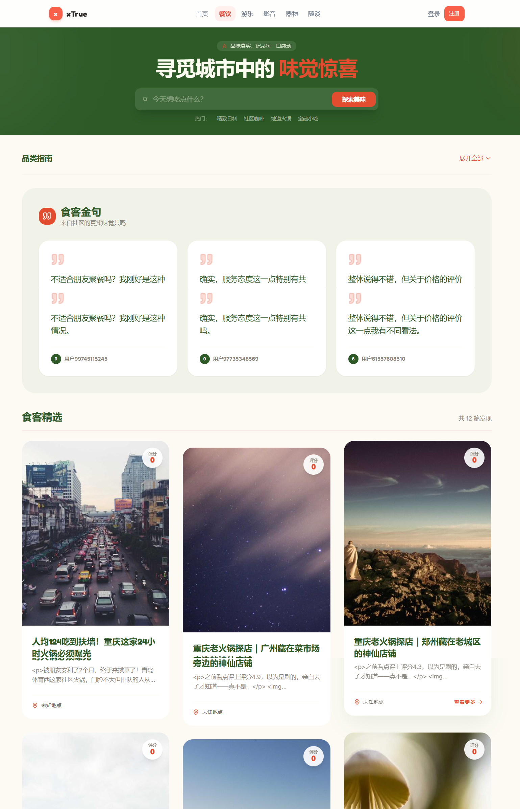

# xTrue — 让真实被听见

> 当评价沦为营销，当推荐被算法裹挟，当"好用"来自从没用过的人——我们还能相信什么？
>
> xTrue 是一份关于**真**的实验。不直接给产品打分，不以消费凭证设门槛，用分层认证与认同度聚合，让真实的声音浮出水面。



---

## 为什么需要 xTrue

今天的消费者评价体系正在系统性失灵：

**劣币驱逐良币。** 商家批量制造虚拟好评，真实用户的声音被淹没在机器生成的噪音里。一个从未用过产品的账号，比深度体验过的用户更容易留下"五星好评 + 三张精修图"。

**平台共谋。** 算法偏爱高互动内容，而虚假评价——煽动、夸张、绝对化——天然更"吸引眼球"。平台没有动力去戳破这些泡沫，因为泡沫本身就是流量。

**沉默的大多数。** 当真实用户的评价被折叠、被刷到底部、被"综合评分"稀释，他们选择沉默。于是你看到的，是少数人希望你看的。

xTrue 的出发点很简单：**让每一次评价都有迹可循，让每一个声音都被平等对待。** 不卖排名，不卖曝光，不对产品直接打分。帖子的价值由他人的认同度（0-100）聚合决定，而非发布者的粉丝数或商家竞价。

这个世界需要一份真。哪怕很小，哪怕很慢。

---

## 核心设计

| 原则 | 说明 |
|------|------|
| **帖子即评价** | 富文本帖子是内容载体，评论为附属层；不对产品直接打星 |
| **认同度聚合** | 用户对帖子打分（0-100），产品综合得分由相关帖子的认同度聚合生成 |
| **分层认证** | L0-L5 递进式权限，从游客到可信用户逐级解锁 |
| **无消费凭证前置** | 不要求订单/票根；真实性由承诺 + AI 辅助审核 + 人工复审 + 反作弊保障 |
| **透明与保密平衡** | 帖子展示分数与打分人数；反作弊规则细节不公开 |

### 品类体系

| 品类 | 关键标识 | 精神 |
|------|----------|------|
| 餐饮 | `dining` | 味觉不需要滤镜 |
| 游乐 | `leisure` | 体验值得被记住 |
| 影音 | `media` | 光影背后是感受 |
| 器物 | `other` | 以挑剔之心，鉴入怀之物 |
| 随谈 | `free` | 让思想自由流动 |

---

## 技术概览

```
Next.js 14 (Turbopack)          —— 前端框架
TypeScript                      —— 类型安全
Tailwind CSS + shadcn/ui        —— 视觉语言
Zustand (auth) + TanStack Query —— 状态管理
httpOnly JWT Cookie             —— 认证方案
MSW (Mock Service Worker)       —— 离线开发/演示
```

> 此前端仓库可独立运行（MSW 拦截 API 返回 mock 数据），无需后端即可体验完整交互。
>

---

## 本地运行

```bash
# 默认启用 MSW mock，无需后端
npm install
npm run dev          # → http://localhost:3000

# 如需对接真实后端，将 .env 中 NEXT_PUBLIC_MOCK_API 置为 false
```

`NEXT_PUBLIC_MOCK_API=true` 时，Service Worker 拦截所有 `/api/*` 请求并返回 mock 数据。适合前端开发、UI 调试、演示。

---

## 写给不同的人

### 如果你是初级开发者

这个项目是一个完整的前端实战范例——路由设计、状态管理、认证流程、组件体系、mock 策略，都是真实项目中的决策。你可以：

- 把品类布局（`src/app/home_*.tsx`）当作 Tailwind 排版练习
- 读 `src/modules/` 下的 hooks + api 层，理解前端数据流的分层
- 用 MSW mock 跑起来，改改 UI，看看效果

### 如果你有想法和共鸣

xTrue 是一个开放的思想实验。你认为评价体系应该怎样运作？分层认证合理吗？认同度聚合比直接评分更公正吗？欢迎 fork、改造成你自己的版本，或者提出你的设计。

---


## 许可

MIT License — 取用自由。你用它做什么都可以，但请保留这份关于"真"的说明。

---

## 关于

xTrue 的产品思路是我存在脑子里十几年的想法。而现在借助AI，几天就可以搭建项目基本功能，一方面希望可以像建立个人信用体系(比如芝麻信用)一样建立其它产品的信用体系，另一方面，希望更多的普通人能表达自己真实的想法，而不是有话筒的人才能发声、会哭的孩子有奶吃...  

最终我知道这个这个项目很难成功，但是**真实地使用它、批评它、改造它**。让一两个真实的声音在各处落地，比任何形式的认可都更有意义。
